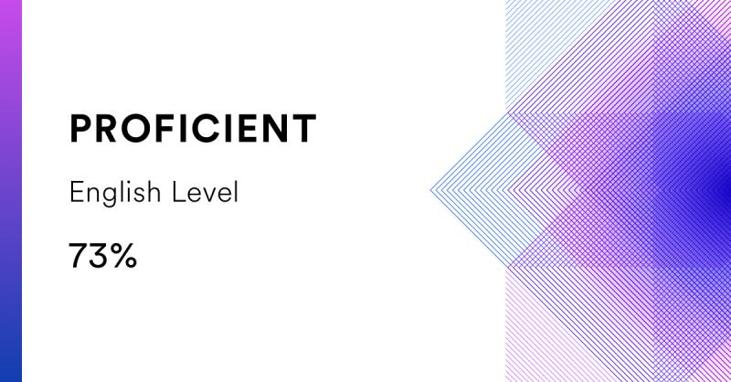

# **Valentin Akimov**

## 📫 Contact info

- **Telegram:** [@OutLaw_tg](https://t.me/outlaw_tg) 
- **Email:** <vaakimov@gmail.com>  
- **Discord:** Valentin Ak(@OutLaw0)
- **GitHub:** [OutLaw0](https://github.com/OutLaw0)  

## 👋 About me

Frontend engineer with 3+ years of commercial experience in product development, including owning a website-builder module built from scratch on Vue 3 and leading a full redesign of a CRM used by thousands of businesses.

Strongest in Vue.js and TypeScript, with solid React experience from freelance and personal projects. Comfortable taking ownership of features end-to-end: from legacy codebase analysis to production release.

Looking for a Middle+ role in a product team where I can combine web fundamentals, independent feature ownership, and an AI-assisted engineering workflow.

## 🌱 Skills

- **Core**
     TypeScript, JavaScript, Vue.js, React, HTML, CSS, Git
- **Project experience**	
     React, Redux Toolkit, REST API, Jest, RTL, Vite / Webpack
- **Additional**	
     PHP, Smarty, jQuery, MySQL, MongoDB, CMS
- **AI workflow**	
    Coding agents, decomposition, implementation, tests, review, documentation

## 💎 Experience

### Frontend Developer · WebAsyst

**January 2023 – June 2026**

- Built the website-builder module from scratch on Vue: architecture, component system, and product behavior. (100+ pre-built blocks, 1,000+ design customization options — within a platform with 75,000+ installs)
- Full redesign of the CRM module: reworked 40+ screens and ~120 components, improving UX consistency and reducing UI-related bug reports by ~30%
- Navigated and extended a large legacy codebase (PHP/Smarty, jQuery, Stylus/Sass) while introducing modern practices in new modules.
- Worked in Agile/Scrum (GitHub Team, GitLab): code review, debugging, cross-team integration.

### Frontend Developer · Freelance

**November 2021 – December 2022**

Freelance development and continued education in JavaScript, TypeScript, React, Vue.js, and PHP.

### Web Developer · OMEGA ltd.

**May 2019 – October 2021**

Developed an online store with over 30,000 products using JavaScript, PHP, HTML, and CSS, with MySQL and Joomla + Virtuemart.

### Earlier & additional experience

- **2022–2026**: Administration of multiple websites for a product company using Bitrix.
- **2013–2020**: Maintained corporate websites, updated HTML/CSS layouts, and developed PHP components.
- **2008–2013**: banking , corporate sites on Joomla/PHP

## 🛠 Projects

<table>
  <tr>
    <td width="33%" valign="top">
      <h3><a href="https://www.webasyst.ru/store/app/crm/">CRM</a></h3>
      
Migration to Vue and other CRM development tasks.

      
<strong>Stack:</strong> Vue.js, JavaScript, PHP, Smarty.

    </td>
    <td width="33%" valign="top">
      <h3><a href="https://www.webasyst.ru/store/app/site/">Website-builder</a></h3>
      
Development of the website-builder module.

      
<strong>Stack:</strong> Vue.js, JavaScript, HTML, Stylus, Sass, PHP, Smarty.

    </td>
    <td width="33%" valign="top">
      <h3><a href="https://github.com/OutLaw0/project-management-app">Project Management App</a></h3>
      
React, Redux, drag-and-drop, REST API, SPA.

    </td>
  </tr>
  <tr>
    <td width="33%" valign="top">
      <h3><a href="https://outlaw0-react2022q3-components.netlify.app">Youtube Api</a></h3>
      
React, Redux, REST API, SPA.

    </td>
    <td width="33%" valign="top">
      <h3><a href="https://github.com/OutLaw0/rslang">RSLang</a></h3>
      
TypeScript, team development, SPA.

    </td>
    <td width="33%" valign="top">
      <h3><a href="https://outlaw0.github.io/rsschool-stg/stage2/online-store/">Online Store</a></h3>
      
TypeScript, Tailwind CSS.

    </td>
  </tr>
</table>

### [Portfolio page](https://outlaw0.github.io/rsschool-stg/Stage0/portfolio/) · [Shelter](https://outlaw0.github.io/rsschool-stg/Stage1/shelter/index.html) · [2048 Game](https://outlaw0.github.io/rsschool-stg/Stage0/js30-3.3-random-game/) · [Movie Api Search](https://outlaw0.github.io/rsschool-stg/Stage0/js30-2.3-movie-app/) · [Virtual Keyboard](https://outlaw0.github.io/rsschool-stg/Stage1/virtual-keyboard/) · [Custom Video Player](https://outlaw0.github.io/rsschool-stg/Stage0/js30-1.3-custom-video/)

## 🔬 Education

### Moscow State University of Economics, Statistics and Computer Science

- Information Systems and Technologies.

### Online education

- freecodecamp.org (Responsive Web Design Certificate, Basic JavaScript);
- HTML Academy (Basic HTML, CSS, JS, PHP courses);
- Udemy. Build Responsive Websites with HTML and CSS;
- RSS Pre-School 2022 ([certificate](https://app.rs.school/certificate/5qnq312q));
- RSS JavaScript/Front-end 2022Q1 ([certificate](https://app.rs.school/certificate/i5mjnoes));
- RSS React 2022 Q3 ([certificate](https://app.rs.school/certificate/udigycsk)).

## English 
* Intermediate (B1)
-----
 
