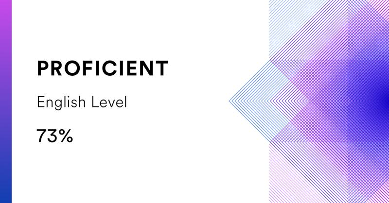

# **Valentin Akimov**

## 📫 Contact info

- **Telegram:** [@OutLaw_tg](https://t.me/outlaw_tg) 
- **Email:** <vaakimov@gmail.com>  
- **Discord:** Valentin Ak(@OutLaw0)
- **GitHub:** [OutLaw0](https://github.com/OutLaw0)  


## 👋 About me

-  Hi, I’m Valentin Akimov
-  I’m interested in Web tecnology and improve my skills
-  I’m currently learning HTML, CSS, JS, Python


## 🌱 Skills

- HTML, CSS (Bootstrap, Sass, Less)
- JavaScript (basics), PHP (basics) 
- DB (MySQL)
- CMS (Joomla + Virtuemart, 1C-Bitrix)
- MS Excel (Power Query, Vba)

&nbsp;

## 👀 Code example


*Decode the Morse code* (from [Codewars](https://www.codewars.com/users/OutLaw0))

```javascript

decodeMorse = function(morseCode){
  
  let words = morseCode.trim().split('   ');
  let sumword1 = '';
  for (let word of words) {
    let sumword = '';
    
    let letters = word.split(' ');
    for (let letter of letters) {
       
       sumword += MORSE_CODE[letter];
      }
    sumword1 += sumword + ' ';
  }
  return sumword1.slice (0, - 1);
  
 
  
}

```

## 💎 Experience

- **2008-2013** - Banking industry
- **2013-2020** - Small own business (delivery service)
- **2019-2021** - Build Online store 30+thousand products (CMS Joomla+Virtuemart)
- other stuff: 
   - buildind small corporate web sites and landings (CMS Joomla)
   - Administration CMS 1C-Bitrix corporate site

## 🔬 Education

- **Moscow State University of Economics, Statistics and Computer Science** 
  - Mathematical Methods in Economics,

- **Online education**
  - freecodecamp.org (Responsive Web Design Certificate, Basic JavaScript);
  - HTML Academy (Basic HTML, CSS, JS, PHP courses);
  - learn.javascript.ru
  - RS PreSchool (in progress...)

## English 
* Intermediate (B1)
-----
 
